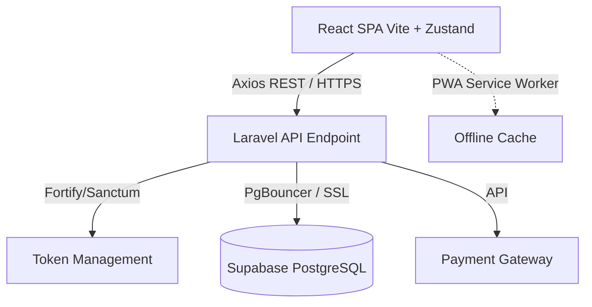
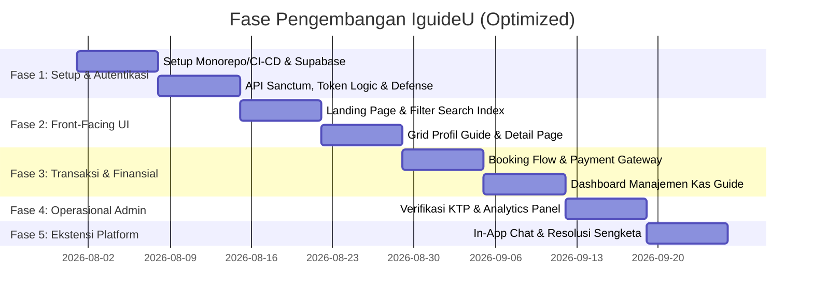

# Product Requirement Document (PRD): IguideU Platform (Optimized)

## 1. Ringkasan Eksekutif & Visi Produk

### 1.1 Visi Produk

**IguideU** adalah platform marketplace pariwisata modern yang secara khusus dan eksklusif menghubungkan wisatawan dengan pemandu wisata (*tour guide*) lokal terverifikasi di Provinsi **Nusa Tenggara Barat (NTB)** — mencakup Lombok Barat, Lombok Tengah (Mandalika), Lombok Timur (Sembalun/Rinjani), Lombok Utara (Gili Islands), Kota Mataram, Sumbawa, Sumbawa Barat (Pulau Moyo), Dompu, dan Bima. Platform ini dirancang untuk **mempercepat** proses penemuan, pemesanan, dan transaksi pemandu wisata lokal NTB tanpa hambatan administratif.

### 1.2 Latar Belakang & Permasalahan

* **Wisatawan:** Membutuhkan akses instan, aman, dan terpercaya ke pemandu lokal NTB yang paham seluk-beluk alam, budaya Sasak & Samawa, serta jalur trekking/maritim setempat.
* **Pemandu Wisata Lokal NTB:** Membutuhkan akses pasar digital langsung dengan transparansi finansial dan manajemen kas yang jelas, tanpa potongan tinggi agen konvensional.
* **Batasan Sistem Lama:** Arsitektur *monolithic* yang usang tidak mampu memberikan pengalaman UI/UX yang adaptif, cepat, dan aman dari sisi pertahanan jaringan.

### 1.3 Solusi Teknologi (Strictly Decoupled)

Rekonstruksi aplikasi menggunakan **Decoupled Architecture** murni untuk skalabilitas maksimal:

* **Frontend:** React 19 (Vite, React Router, Zustand untuk State Management) dengan Tailwind CSS v4 & PWA.
* **Backend:** Laravel RESTful API murni + Sanctum Token-Based Auth + Fortify.
* **Database:** Supabase PostgreSQL dengan pengaktifan *Connection Pooling* (PgBouncer).

---

## 2. User Personas & Peran Pengguna

| Peran Pengguna | Fokus Kebutuhan |
| --- | --- |
| **Traveler (Wisatawan)** | Pencarian instan dan akurat, transparansi harga, kepastian jadwal, dan jalur komunikasi aman. |
| **Tour Guide (Pemandu)** | Pemasaran profil otomatis, jadwal fleksibel, dan *dashboard* manajemen kas/finansial yang transparan. |
| **Admin Platform** | Alat verifikasi cepat, resolusi sengketa, pengawasan arus transaksi, dan analitik performa. |

---

## 3. Persyaratan Fungsional (Functional Requirements)

### 3.1 Autentikasi & Keamanan (Core Auth)

* **Login Multi-Opsi:** Email/Password, Google OAuth 2.0, dan Passkeys.
* **Two-Factor Authentication (2FA):** Dikelola via Laravel Fortify.
* **Manajemen Sesi:** Implementasi rotasi token Sanctum dengan *expiration time* ketat untuk mengamankan data pengguna.

### 3.2 Modul Traveler (Pencarian & Pemesanan)

* **Landing Page Interaktif:** Menggunakan narasi desain yang berfokus pada kecepatan layanan (*mempercepat* koneksi wisata).
* **Katalog Guide Responsif:** *Grid card* yang dinamis menggunakan *flex-basis* untuk kalkulasi dimensi proporsional, menampilkan tarif, rating, dan spesialisasi.
* **Sistem Checkout Transparan:** Ringkasan biaya lengkap (Biaya Guide + Platform Fee).
* **Metode Pembayaran:** Integrasi Gateway (QRIS, E-Wallet, Virtual Account) dengan e-invoice digital.

### 3.3 Modul Tour Guide (Manajemen & Finansial)

* **Onboarding Terverifikasi:** Unggah mandiri KTP, Sertifikat BNSP/HPI, dan foto diri.
* **Pengaturan Paket & Jadwal:** Kalender interaktif untuk manajemen ketersediaan.
* **Dashboard Manajemen Kas:** Antarmuka khusus untuk transparansi finansial, melacak total pendapatan kotor, potongan komisi, saldo siap tarik, dan riwayat penarikan dana ke rekening lokal.

### 3.4 Resolusi Layanan & Komunikasi (New Addition)

* **In-App Messaging:** Ruang obrolan *real-time* aman antara Traveler dan Guide (aktif pasca-pembayaran) tanpa bertukar nomor telepon pribadi.
* **Manajemen Sengketa (Dispute & Refund):** Alur pengajuan pengembalian dana akibat keadaan kahar (*force majeure*) atau pembatalan sepihak, ditengahi langsung oleh Admin.

### 3.5 Modul Admin Platform (Pengawasan)

* **Peninjauan Dokumen:** Antarmuka persetujuan (*Approve/Reject*) identitas *guide*.
* **Analitik Multi-Parameter:** *Dashboard* statistik memuat data transaksi bulanan, lalu lintas pendaftaran, dan waktu rata-rata penyelesaian tur.

---

## 4. Persyaratan Non-Fungsional (Non-Functional Requirements)

### 4.1 UI/UX & Styling Modern

* **Desain Adaptif:** Penggunaan *logical properties* seperti `margin-inline` dan `padding-inline` di Tailwind CSS v4 untuk menjaga konsistensi spasi pada tata letak *mobile* (Bottom Navigation) maupun desktop (Top Navbar).
* **Skema Warna (Luxury Navy & Gold):**
* Utama: `#0D182E` (Navy) & `#16223B` (Surface)
* Aksen: `#C5A059` (Gold)

* **State Management:** Penggunaan Zustand di React untuk menyimpan status filter pencarian dan keranjang *booking* sementara tanpa memberatkan API.

### 4.2 Network Defense & Keamanan Infrastruktur

* **Rate Limiting:** Pemasangan filter *throttle* pada rute API esensial (Login, Register, Search) untuk mencegah *brute force* dan perayapan (*scraping*) data secara massal.
* **SSL Wajib:** Enkripsi koneksi PostgreSQL ke Supabase menggunakan protokol `sslmode=require`.

### 4.3 PWA & Optimasi Kecepatan

* Pencapaian **Lighthouse Score > 90**.
* Dukungan *Service Worker* untuk *caching* aset statis.
* Optimalisasi respons pencarian dengan implementasi *Database Indexing* pada Supabase (khususnya untuk kolom kota, provinsi, dan ketersediaan tanggal).

---

## 5. Arsitektur Infrastruktur & Basis Data

### 5.1 Peta Sistem (Decoupled & Serverless DB)

### 5.2 Optimasi Skema Data (Data Model)

* Struktur tabel tetap mempertahankan `users`, `guide_profiles`, `tour_packages`, `guide_availabilities`, `bookings`, dan `payments`.
* **Penambahan Index:** `INDEX(city, province)` pada `guide_profiles` dan `INDEX(date)` pada `guide_availabilities` untuk mempercepat kueri filter wilayah.
* **Tabel Tambahan:**
* `chats`: `id`, `booking_id`, `sender_id`, `message`, `read_at`, `timestamps`.
* `disputes`: `id`, `booking_id`, `complainant_id`, `reason`, `status`, `admin_notes`.

---

## 6. Peta Jalan Pengembangan Terpadu

---

## 7. Indikator Kinerja Utama (KPI)

1. **Efisiensi Teknis:** Waktu respons API `API Response Time < 200ms` saat beban pencarian tinggi; *Lighthouse Score* minimal 90.
2. **Kinerja Konversi:** Tingkat keberhasilan transaksi *Checkout to Paid* mencapai minimum `85%`.
3. **Keamanan:** Nol insiden eksfiltrasi data pengguna dan *uptime* koneksi basis data di atas `99.9%`.
